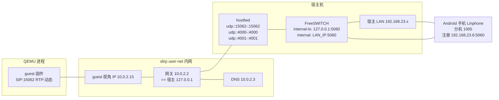

# WORKLOG 2026-08-25：网络拓扑与配置全景（明天整体看的"接线图"）

> 目的：把当前"有点绕"的网络配置一次性讲清楚，作为后续优化的基线。
> 涉及：QEMU guest（固件）/ QEMU slirp NAT / hostfwd / 宿主 FreeSWITCH（两个 sofia profile）/ Android 手机。

---

## 1. 整体拓扑图



**一句话**：guest 在一个独立 NAT 里（10.0.2.x），唯一出口是网关 `10.0.2.2`（= 宿主 127.0.0.1）。FreeSWITCH 在宿主上绑了两个 profile：loopback 口（接 guest）和 LAN 口（接手机）。guest 注册走 loopback 口，手机走 LAN 口。

---

## 2. 三层地址角色（最容易绕的地方）

| 地址 | 谁在用 | 作用 |
|---|---|---|
| `10.0.2.15` | guest 网卡 | guest 内部 IP（slirp 分配，**对外不可达**，只在本 NAT 内有效） |
| `10.0.2.2` | guest 视角 | slirp 网关 = **宿主 127.0.0.1 的别名**。guest 发往 10.0.2.2 = 发给宿主 loopback。**固定值，不依赖宿主 DHCP** |
| `127.0.0.1` | guest 的 SIP/RTP "公网地址" | guest 通过 `public_addr` 对外宣称自己是 127.0.0.1；宿主经 hostfwd 把 `127.0.0.1:<hostfwd端口>` 映射回 guest |
| `192.168.23.x` | 宿主 LAN | 手机所在网段，FreeSWITCH `internal` profile 的域 |

**核心技巧**：guest 想让宿主能反向找到自己，就必须对外宣称 `127.0.0.1:<hostfwd端口>`（而不是 `10.0.2.15`）。这就是 `tcfg.public_addr` / `rtp_cfg.public_addr` 都设 `127.0.0.1` 的原因。

---

## 3. SIP 消息里各字段分别填什么（guest 侧配置）

| SIP 字段 | guest 填的值 | 为什么 |
|---|---|---|
| `Request-URI`（拨出） | `sip:1005@192.168.23.6:5060` | 路由到手机（走 internal 域） |
| `To`（注册/被叫域） | `sip:1000@192.168.23.6` | `acc_cfg.id`，让 1000 绑定到手机同域（`sofia_contact` 能找到） |
| `Via`/`Contact` | `127.0.0.1:15062` | `tcfg.public_addr`，宿主经 hostfwd 可达 |
| `reg_uri`（REGISTER 目标） | `sip:10.0.2.2:5060` | 走 internal-lo；源=127.0.0.1 → 不被 nat.auto 重写 Contact |
| 出站代理 `proxy[0]` | `sip:10.0.2.2:5060` | 拨出第一跳也走 internal-lo，dialog 与注册同 profile |
| SDP `c=`/RTP 地址 | `127.0.0.1` | `rtp_cfg.public_addr`，宿主 RTP 发到 hostfwd 端口 |
| SDP RTP 端口 | pjsua 自动分配 | 宿主经 `hostfwd udp::4000-:4000`（媒体用动态，见 §6） |

---

## 4. FreeSWITCH 两个 profile 分工

| Profile | SIP 绑定 | 域 | 谁注册 | 起什么作用 |
|---|---|---|---|---|
| `internal` | `0.0.0.0:5060`（LAN `192.168.23.6`） | `192.168.23.6` | 手机 1005 | 手机的正常服务 |
| `internal-lo` | `127.0.0.1:5060`（guest 经 slirp 看 = `10.0.2.2`） | `10.0.2.2` | guest 1000 | 给 guest 一个**固定可达**的入口 |

**关键点**：
- guest **注册**在 internal-lo（reg_uri=10.0.2.2），但注册表的**域**（To）是 `192.168.23.6`（internal 的域）→ 1000 在手机域里可见。
- 一旦 guest 注册在 internal-lo、注册域设为 LAN，**guest 的拨出也必须先经过 internal-lo**（出站代理）→ 拨出 dialog 也建在 internal-lo → 手机挂断的 BYE 能在 internal-lo 里找到 1000 的 Contact（`127.0.0.1:15062`）。

### 配置文件一览（改的是 `C:\Program Files\FreeSWITCH\conf\...`，脚本均有 .bak 备份）

| 脚本 | 作用 |
|---|---|
| `works/tools/fs_bind_all.ps1` | `internal.xml` 绑 `0.0.0.0`（sip-ip/rtp-ip 全绑，手机+guest 都可达） |
| `works/tools/fs_add_loopback_profile.ps1` | 新增 `sip_profiles/internal-lo.xml`（sip-ip=127.0.0.1:5060，rtp-ip=LAN IP） |
| `works/tools/fs_fix_loopback_domain.ps1` | `directory/default.xml` 加完整 `<domain name="10.0.2.2">` 块（alias=true 不行→403，必须完整块） |
| `works/tools/fs_remove_default_password_sleep.ps1` | 去掉 default.xml 里默认密码 1234 触发的每通 `sleep 10000` |

> 备注：`internal-lo` profile 的 `apply-nat-acl=nat.auto` —— 源地址 127.0.0.1 不在 nat.auto 里，所以 Contact 不会被重写。这是 guest 必须从 loopback 出发的本质原因。

---

## 5. 三个方向的完整路径

### 5.1 注册（guest → FreeSWITCH）

```
REGISTER sip:10.0.2.2:5060
  To:     sip:1000@192.168.23.6     ← 注册域 = LAN 域
  Contact: sip:1000@127.0.0.1:15062  ← public_addr
  Via:    127.0.0.1:15062
→ slirp 到 10.0.2.2 → 宿主 127.0.0.1:5060 (internal-lo)
→ FS 存：1000@192.168.23.6 → Contact 127.0.0.1:15062
→ 200 OK 回到 127.0.0.1:15062 → hostfwd → guest
```

### 5.2 拨出（guest → 手机），经出站代理

```
INVITE sip:1005@192.168.23.6:5060     ← Request-URI 不变（路由到手机）
  (路由集含出站代理) 第一跳 → 10.0.2.2:5060 (internal-lo)
  Contact: 127.0.0.1:15062
→ FS internal-lo 处理，转发 INVITE 到手机（internal 域）
→ 手机应答 200 → FS 回 200 → 到 127.0.0.1:15062 → hostfwd → guest
→ 手机挂断：BYE → FS 在 internal-lo 找 1000 的 Contact
   = 127.0.0.1:15062（带端口）→ hostfwd → guest OK
```

### 5.3 拨入（手机 → guest）

```
手机 INVITE sip:1000@192.168.23.6 → FS internal
FS 查 sofia_contact(1000@192.168.23.6) = 127.0.0.1:15062（注册表里 LAN 域能找到）
→ 转发 INVITE → hostfwd → guest
→ guest 应答 200，Contact 127.0.0.1:15062
→ 手机挂断：BYE → FS internal → 1000@192.168.23.6 的 Contact → hostfwd → guest OK
```

---

## 6. 端口 / hostfwd 映射

| 端口 | 用途 | hostfwd 映射 |
|---|---|---|
| `15062` | guest SIP UDP | `udp::15062-:15062`（原样） |
| `4000` / `4001` | guest RTP / RTCP（固定测试） | `udp::4000-:4000`、`udp::4001-:4001` |

> 现状：SIP 端口固定 15062；**RTP 端口是 pjsua 自动分配的**，hostfwd 只预置了 4000/4001（供早期固定端口测试用）。当前通话的 RTP 若落在动态端口，宿主→guest 方向 RTP 会受限（slirp 对未 hostfwd 的入方向有限制）。这是明天可优化点之一（见 §8）。

### QEMU 启动参数

```powershell
qemu-system-arm.exe -machine mps2-an505 -cpu cortex-m33 -m 16M `
  -kernel .\an505-qemu.elf `
  -display sdl,show-cursor=on -serial stdio `
  -nic "user,id=n0,model=lan9118,mac=52:54:00:12:34:01,hostfwd=udp::15062-:15062,hostfwd=udp::4000-:4000,hostfwd=udp::4001-:4001"
```

---

## 7. 为什么"绕"（梳理现状痛点）

1. **三套地址语义混在一起**：10.0.2.x（NAT 内）、127.0.0.1（hostfwd 回环别名）、192.168.23.x（真实 LAN），而且 10.0.2.2 同时是"网关"和"宿主 loopback 别名"，容易混淆。
2. **两个 profile 各管一摊**：guest 注册和拨出必须都走 internal-lo，但又要把注册域设成 internal 的域——"注册在 A、域挂在 B、拨出也走 A"这种组合不直观。
3. **NAT 重写的隐性影响**：`apply-nat-acl=nat.auto` 会在源地址属于 NAT ACL 时重写 Contact；guest 必须从 loopback（127.0.0.1）出发才能躲过重写——这是反复踩坑的根源。
4. **SIP 字段太多，每个都要对**：Request-URI / To / reg_uri / Contact / Via / 出站代理 / SDP 地址，任一填错就是"能注册不能呼叫"或"能呼叫不能挂断"。

---

## 8. 明天可做的简化 / 优化方向（讨论用）

1. **固定 RTP 端口**：给 pjsua 配固定 RTP 端口区间并全部 hostfwd，宿主→guest RTP 全通（当前动态端口只在拨入/拨出某几条路径下可靠）。
2. **收敛到一个域**：如果允许，把 guest 也直接注册到 internal（LAN 域）并让 `internal` profile 对 loopback 不重写 Contact（加一条 loopback 到 local-network ACL），可去掉 internal-lo 的复杂性 —— 需要实测 Contact 是否仍被重写。
3. **抽一个"拓扑配置表"**：把 §3 的字段填写规则固化成注释/文档，改 IP 时对照改，避免再次"猜"。
4. **考虑 sock 直连**：若可接受双 QEMU，socket 后端免 NAT（历史验证过），但真实手机仍要走 slirp+FS。
5. **把 hostfwd 收拢进一个脚本**：`run_phone_fs_test.ps1` 已能自动起 QEMU；可再封装成"一键起环境 + 打印各 profile 状态"的脚本。

---

## 9. 相关文件索引

| 位置 | 内容 |
|---|---|
| `boards/mps2-an505/FreeRTOS/application/pj_phone.c` | 全部网络相关配置（宏 + acc_cfg/transport/media_cfg） |
| `boards/mps2-an505/FreeRTOS/application/pj_phone.h` | 标准电话接口 |
| `libutils/pjproject/ports/freertos/CMakeLists.txt` | pjproject 精简构建 + autoconf 头生成 |
| `works/tools/fs_*.ps1` | FreeSWITCH 配置脚本（绑定 / loopback profile / 域 / 去 sleep） |
| `works/tools/run_phone_fs_test.ps1` | 自动起 QEMU + FreeSWITCH 联调 |
| `works/logs/WORKLOG-2026-08-25-phone-app.md` | 功能开发总结（设计/实现/调试） |
| `works/logs/WORKLOG-2026-08-25-phone-issues.md` | 问题与解决思路（含挂断检测重点） |
